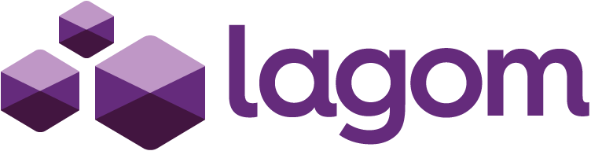

[](https://github.com/lagom/lagom)

[](https://gitter.im/lagom/lagom?utm_source=badge&utm_medium=badge&utm_campaign=pr-badge&utm_content=badge) [](https://travis-ci.org/lagom/lagom)

# INTRO
Lagom is a Swedish word meaning just right, sufficient. Microservices are about creating services that are just the right size, that is, they have just the right level of functionality and isolation to be able to adequately implement a scalable and resilient system.

Lagom focuses on ensuring that your application realises the full potential of the [Reactive Manifesto](http://reactivemanifesto.org/), while delivering a high productivity development environment, and seamless production deployment experience.

This is a sample Scala auction site using the Lagom Framework. A [java version](https://github.com/lagom/online-auction-java) of the auction site is also available.

## Getting started
To get started make sure you have sbt and git installed on your system. You will also need an active internet connection.

### Running: Prerequisites

- You will need to download and run an Elastisearch server:

```
curl -L -O https://artifacts.elastic.co/downloads/elasticsearch/elasticsearch-5.0.2.tar.gz
tar -xvf elasticsearch-5.0.2.tar.gz
cd elasticsearch-5.0.2/bin
./elasticsearch
```
### Running

On another terminal, clone this repo and run the sample app using the command `sbt runAll`:

```
git clone git@github.com:lagom/online-auction-scala.git
cd online-auction-scala
sbt runAll
```

# Auction system - System architecture

The auction system is the sum of 5 micro-services and a web gateway:

* **[Item Service](docs/item-service.md)**: Manages the description and auction status (created, auction, completed, cancelled) of an item.
* **[Bidding service](docs/bidding-service.md)**: Manages bids on items.
* **[Search service](docs/search-service.md)**: Handles all item searching.
* **[Transaction service](docs/transaction-service.md)**: Handles the transaction of negotiating delivery info and making payment of an item that has completed an auction.
* **[User service](docs/user-service.md)**: a convenience service to stub user management. Don't use any code in `user-service` as reference on how to create a secure user management micro-service.
* **web-gateway**: a [Play](https://www.playframework.com/) application providing web UI and acting as gateway to all previously described services.

Check the docs for each service for details on the **commands** and **queries** it serves as well as events the service **emits** and events it **consumes** from the [Message Broker](http://www.lagomframework.com/documentation/1.3.x/scala/MessageBrokerApi.html#Message-Broker-Support).

## Good to know

- Hello World Gitter8 seed

For a simple, gentler, introduction to Lagom, have a look at the [Hello World gitter8 seed project](http://www.lagomframework.com/documentation/1.3.x/scala/GettingStarted.html) in the docs.

- Getting help

If you have any troubles and need help, feel free to ask in the [Gitter channel](https://gitter.im/lagom/lagom)

